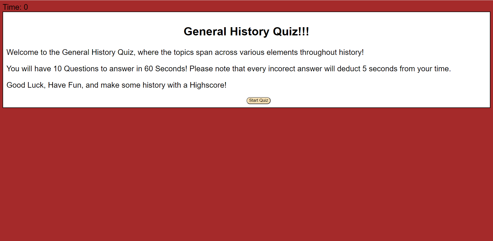
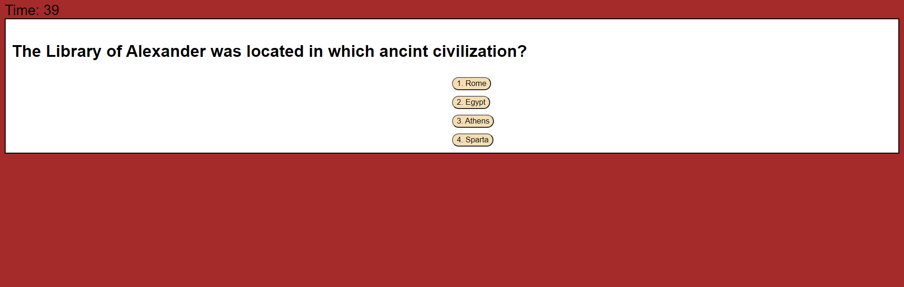
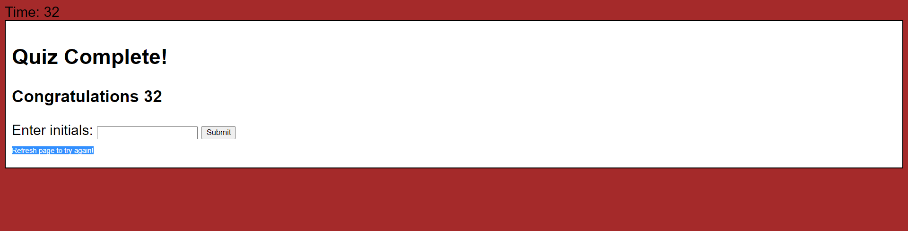

HW-4-Code-Quiz

The following is a history quiz made with HTML, CSS, and JAVA. 

This 10 question quiz is on random, general history knowledge and trivia! Users will have 60 seconds to complete the quiz.
selected choices will have the quiz proceed to the next question, however, incorrect choices will deduct 5 seconds from the players time!
Quiz will be complete when all questions are answered, or time reaches 0. 
Users will be able to log and submit their final initials and final scores!

Links:
GIT: https://github.com/coreylevine2000/hw-4-code-quiz
LIVE: https://coreylevine2000.github.io/hw-4-code-quiz/